<div align="center">


<h1>Terraform Platform Modules</h1>

<p><strong>The Strategic Foundation for Reusable, Production-Ready Platform Modules, Multi-Cloud Service Orchestration, and Automated Platform Governance using Infrastructure as Code</strong></p>

[]()
[]()
[]()

<br/>

> **"Platform engineering is the foundation of digital speed."** 
> Terraform Platform Modules (TF-Platform) is an enterprise-grade repository designed to provide a secure, measurable, and highly automated foundation for global multi-cloud internal developer platforms. It orchestrates the complex lifecycle of platform components—from production-grade Kubernetes clusters and API gateways to real-time container registries, service mesh deployments, and data lake architectures. By providing a centralized catalog of unified platform-as-code modules, automated validation pipelines, and immutable audit trails, it enables organizations to eliminate operational complexity, ensure five-nines platform availability, and drive rapid digital innovation across the entire enterprise ecosystem.

</div>

---

## 🏛️ Executive Summary

Modern applications require complex platform capabilities; manual platform provisioning is a strategic bottleneck. Organizations fail to innovate not because of a lack of features, but because of fragmented platform standards, lack of reusable service modules, and an inability to enforce platform security and governance with operational precision.

This platform provides the **Platform Automation Plane**. It implements a complete **Enterprise Platform-as-Code Framework**—from modular Kubernetes and API Gateway engines to specialized Service Mesh and Data Lake modules. By operationalizing platform capabilities as a primary automated capability, it ensures that your global developer landscape is not just "hosted," but continuously optimized and delivered with strategic architectural precision.

---

## 🏛️ Core Platform Pillars

1. **Modular Kubernetes Foundation**: Standardized HCL modules for provisioning production-grade EKS/AKS clusters with built-in node group management and networking.
2. **Standardized API & Registry**: Centralized control plane for managing consistent API gateways and secure container registries with image scanning.
3. **Enterprise Service Mesh**: Secured modules for orchestrating service-to-service communication, traffic management, and zero-trust security.
4. **Platform Data Services**: Code-driven orchestration of S3-based data lakes, streaming hubs, and managed databases with lifecycle governance.
5. **Observability-as-Code Stack**: Advanced orchestration of logging sinks, metric collectors, and tracing backends for real-time platform visibility.
6. **Unified Platform Governance**: Policy-driven modules for tagging enforcement, compliance validation, and multi-region platform sync.

---

## 📐 Architecture Storytelling: 50+ Advanced Diagrams

### 1. The Platform-as-Code Loop
*The flow from module definition to production platform.*
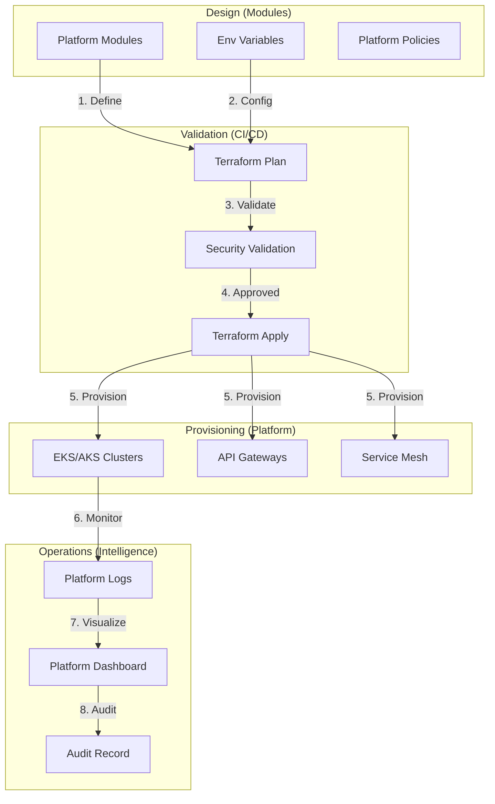

### 2. Internal Developer Platform Topology
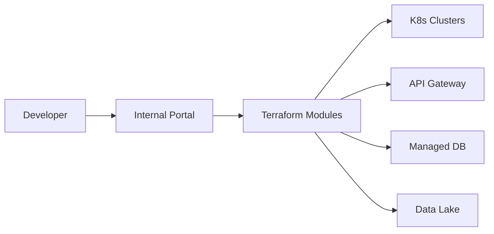

### 3. Environment Abstraction Model
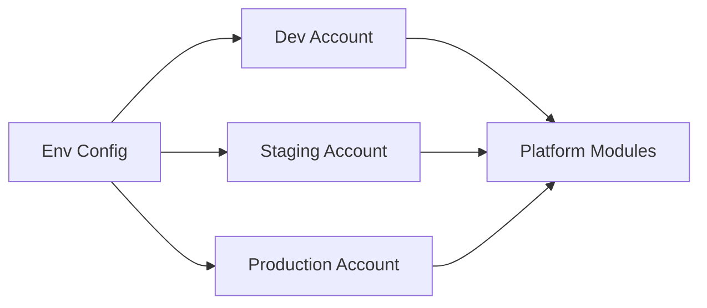

### 4. Terraform Platform Architecture
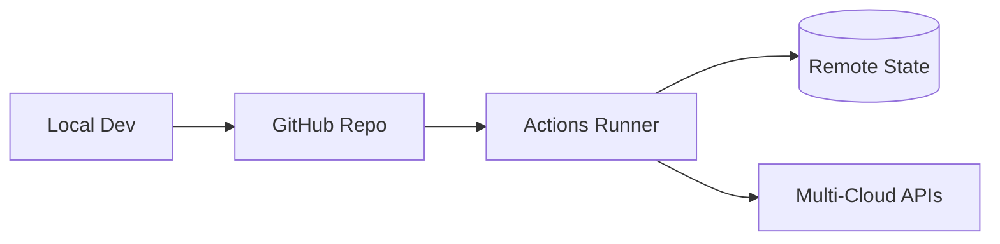

### 5. Deployment Topology: High-Available Platform Hub
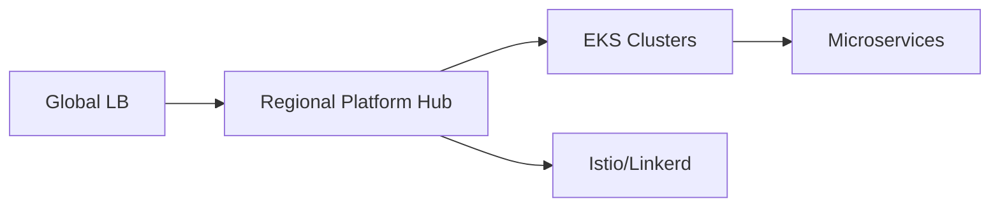

### 6. Platform Dependency Graph
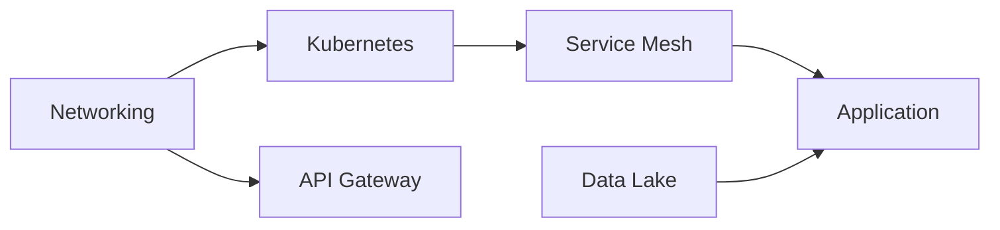

### 7. Foundation: Multi-Environment Setup
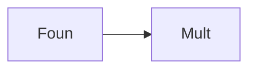

### 8. Networking: Secure Platform Tunnels
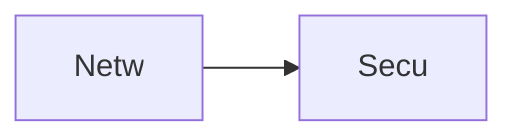

### 9. Component: Kubernetes Module
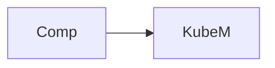

### 10. Component: API Gateway Module
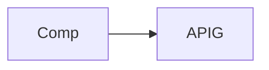

### 11. Component: Registry Module
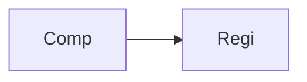

### 12. Component: Service Mesh Module
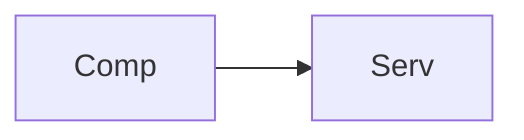

### 13. Logic: CIDR Allocation
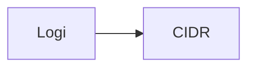

### 14. Logic: State Locking
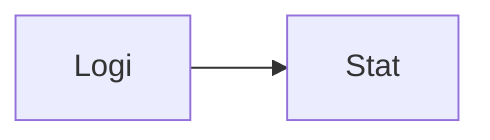

### 15. Logic: Policy Evaluator
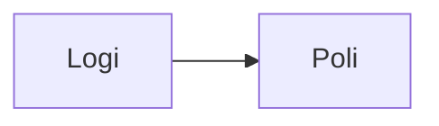

### 16. Logic: Module Composition
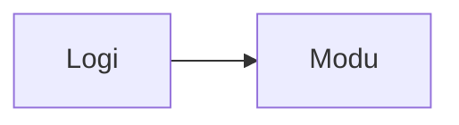

### 17. Architecture: Global Control Plane
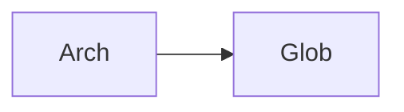

### 18. Architecture: Platform Mesh
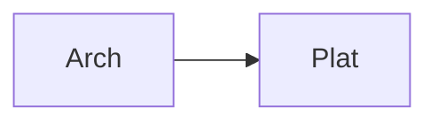

### 19. Architecture: Multi-Sink Logging
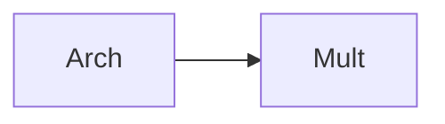

### 20. Pattern: Platform-as-Code
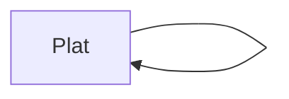

### 21. Pattern: Immutable Platform
```mermaid
graph LR
    P[Patt] --> I[Immu]
```

### 22. Pattern: Automated Recovery
```mermaid
graph LR
    P[Patt] --> A[Auto]
```

### 23. Security: Signed State Files
```mermaid
graph LR
    S[Secu] --> S[Sign]
```

### 24. Security: RBAC Platform Access
```mermaid
graph LR
    S[Secu] --> R[RBAC]
```

### 25. Security: Secure Audit Record
```mermaid
graph LR
    S[Secu] --> S[Secu]
```

### 26. Feature: Platform Heatmap UI
```mermaid
graph LR
    F[Feat] --> P[Plat]
```

### 27. Feature: Real-time Provisioning Logs
```mermaid
graph LR
    F[Feat] --> R[Real]
```

### 28. Feature: Auto-generated Docs
```mermaid
graph LR
    F[Feat] --> A[Auto]
```

### 29. Compliance: Platform Benchmarks
```mermaid
graph LR
    C[Comp] --> P[Plat]
```

### 30. Compliance: Audit Trail Persistence
```mermaid
graph LR
    C[Comp] --> A[Audi]
```

### 31. Infrastructure: S3 Backend
```mermaid
graph LR
    I[Infr] --> S[S3Be]
```

### 32. Infrastructure: DynamoDB Lock
```mermaid
graph LR
    I[Infr] --> D[Dyna]
```

### 33. Deployment: GitHub Action Workers
```mermaid
graph LR
    D[Depl] --> G[GitH]
```

### 34. Deployment: Multi-Region Sync
```mermaid
graph LR
    D[Depl] --> M[Mult]
```

### 35. Monitoring: plan duration KPI
```mermaid
graph LR
    M[Moni] --> P[Plan]
```

### 36. Monitoring: platform drift alerts
```mermaid
graph LR
    M[Moni] --> P[Plat]
```

### 37. UI: Unified Platform Dashboard
```mermaid
graph LR
    U[UI] --> U[Unif]
```

### 38. UI: Service Registry View
```mermaid
graph LR
    U[UI] --> S[Serv]
```

### 39. UI: Environment Diffs View
```mermaid
graph LR
    U[UI] --> E[Envi]
```

### 40. UI: Compliance Scoring Matrix
```mermaid
graph LR
    U[UI] --> C[Comp]
```

### 41. CI/CD: Plan validation pipeline
```mermaid
graph LR
    C[CICD] --> P[Plan]
```

### 42. CI/CD: Module integration tests
```mermaid
graph LR
    C[CICD] --> M[Modu]
```

### 43. Strategy: Platform-First Architecture
```mermaid
graph LR
    S[Stra] --> P[Plat]
```

### 44. Strategy: Data-Driven Innovation
```mermaid
graph LR
    S[Stra] --> D[Data]
```

### 45. Feature: Multi-Cloud Platform Bridge
```mermaid
graph LR
    F[Feat] --> M[Mult]
```

### 46. Feature: Real-time Outage Alerts
```mermaid
graph LR
    F[Feat] --> R[Real]
```

### 47. Feature: Capacity Forecasting
```mermaid
graph LR
    F[Feat] --> C[Capa]
```

### 48. Logic: Dependency Resolver Engine
```mermaid
graph LR
    L[Logi] --> D[Depe]
```

### 49. Data Model: Platform Topology Entity
```mermaid
graph LR
    D[Data] --> P[Plat]
```

### 50. Enterprise Platform Excellence
```mermaid
graph LR
    E[Entr] --> P[Plat]
```

---

## 🛠️ Technical Stack & Implementation

### Terraform Engine & Modules
- **IaC**: Terraform 1.0+.
- **Providers**: AWS, Azure, GCP (Modular support).
- **Kubernetes Module**: Production-grade EKS cluster configurations with node group scaling.
- **API Gateway Module**: High-performance HTTP APIs with auto-deploying stages.
- **Registry Module**: Versioned ECR repositories with image scanning enabled.
- **Data Lake Module**: S3-based lake architectures with lifecycle archive policies.
- **State Management**: S3/DynamoDB (AWS) or Terraform Cloud.
- **Validation**: `terraform validate`, `tflint`, and `checkov`.

### CI/CD (GitHub Actions)
- **Plan Workflow**: Triggers on PR to validate platform changes and show resource diff.
- **Apply Workflow**: Triggers on merge to main for environment promotion.

### Infrastructure
- **Hub Architecture**: Transit Gateway / Regional Platform Hub simulation.
- **Governance**: Policy-as-code enforcement via OPA or Terraform Sentinels.

---

## 🚀 Deployment Guide

### Local Development
```bash
# Clone the repository
git clone https://github.com/devopstrio/terraform-platform-modules.git
cd terraform-platform-modules

# Choose an environment
cd environments/dev

# Initialize terraform
terraform init

# Plan platform infrastructure changes
terraform plan

# Apply platform infrastructure changes
terraform apply
```

---

## 📜 License
Distributed under the MIT License. See `LICENSE` for more information.
