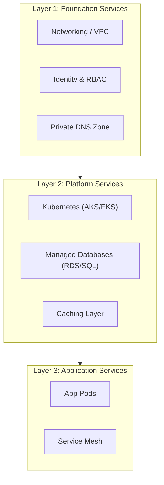
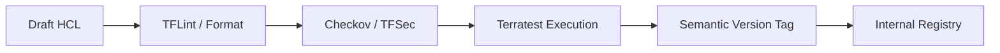
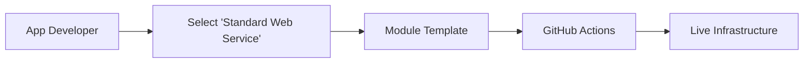
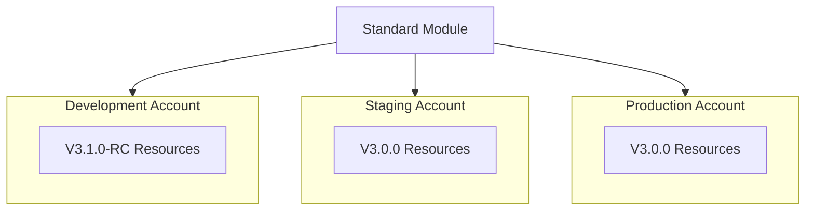
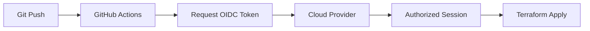
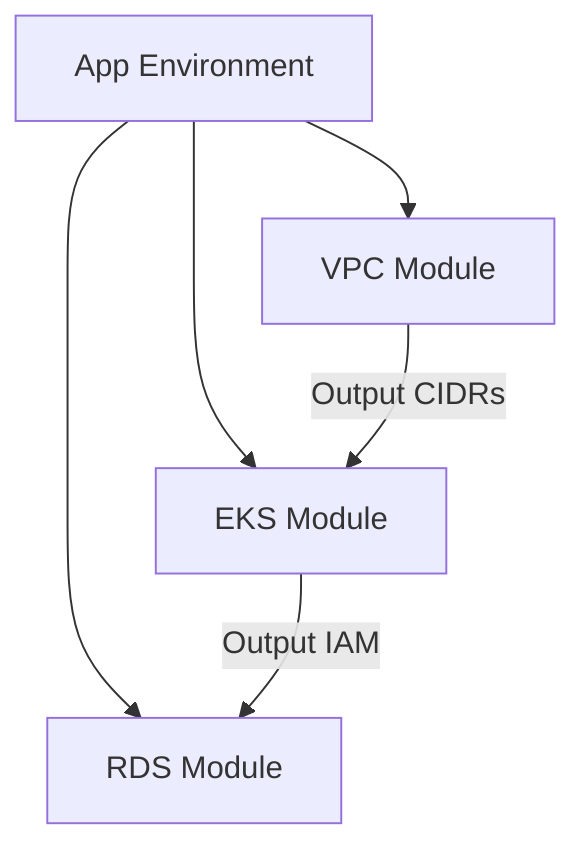
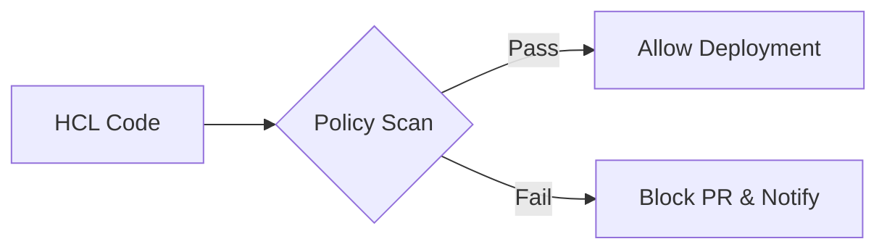
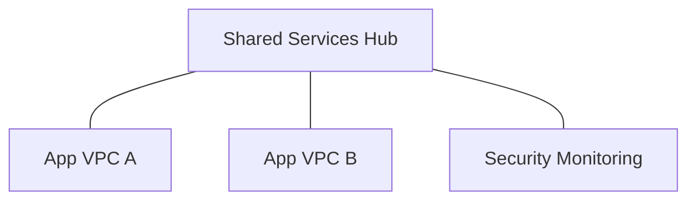
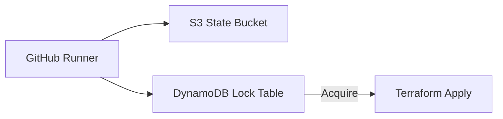

<div align="center">


<h1>Terraform Platform Modules</h1>

<p><strong>The Strategic Foundation for Reusable, Production-Ready Platform Modules, Multi-Cloud Service Orchestration, and Automated Platform Governance.</strong></p>

[]()
[]()
[]()

<br/>

> **"Platform engineering is the foundation of digital speed."** 
> **Terraform Platform Modules (TF-Platform)** is an institutional-grade repository designed to provide a secure, measurable, and highly automated foundation for global multi-cloud internal developer platforms. It orchestrates the entire lifecycle of platform components—from production-grade Kubernetes clusters to data lake architectures.

</div>

---

## 🏛️ Executive Summary

Modern applications require complex platform capabilities; manual platform provisioning is a strategic bottleneck. Organizations often fail to innovate not because of a lack of features, but because of fragmented platform standards and an inability to enforce security and governance with operational precision.

This platform provides the **Platform Automation Plane**. It implements a complete **Enterprise Platform-as-Code Framework**, enabling engineering teams to manage Kubernetes, API Gateways, and Data Services as reusable, versioned modules. By treating platform capabilities as code, we ensure that the global developer landscape is continuously optimized and delivered with strategic architectural precision.

---

## 📐 Architecture Storytelling: Principal Reference Models

### 1. Principal Architecture: Multi-Cloud Modular IaC Ecosystem
This diagram illustrates the end-to-end flow from module development to multi-cloud resource provisioning.

```mermaid
graph LR
    %% Subgraph Definitions
    subgraph Development["Module Development Zone"]
        direction TB
        Code[HCL Module Code]
        Tests[Terratest / Kitchen]
        Registry[Private Module Registry]
    end

    subgraph Intelligence["IaC Intelligence & Governance"]
        direction TB
        Plan[Terraform Plan Engine]
        Policy[Compliance-as-Code (Checkov)]
        State[Remote State (S3/DynamoDB)]
    end

    subgraph Provisioning["Multi-Cloud Platform Provisioning"]
        direction TB
        Azure[Azure Resources]
        AWS[AWS Resources]
        GCP[GCP Resources]
    end

    subgraph IDP["Internal Developer Platform (IDP)"]
        direction TB
        Portal[Backstage / Developer Portal]
        CLI[Platform CLI]
        Catalog[Service Catalog]
    end

    subgraph DevOps["CI/CD & GitOps Orchestration"]
        direction TB
        GH[GitHub Actions]
        OIDC[OIDC Identity Provider]
        Slack[Alerting & Notifications]
    end

    %% Flow Arrows
    Code -->|1. Test & Version| Registry
    Registry -->|2. Consume| Portal
    Portal -->|3. Trigger Build| GH
    GH -->|4. Authenticate| OIDC
    GH -->|5. Validate| Policy
    GH -->|6. Execute| Plan
    Plan -->|7. Lock State| State
    Plan -->|8. Apply| Provisioning
    
    Provisioning -->|Telemetry| Slack

    %% Styling
    classDef dev fill:#f5f5f5,stroke:#616161,stroke-width:2px;
    classDef intel fill:#ede7f6,stroke:#311b92,stroke-width:2px;
    classDef prov fill:#e8f5e9,stroke:#1b5e20,stroke-width:2px;
    classDef idp fill:#fff3e0,stroke:#e65100,stroke-width:2px;
    classDef cicd fill:#fffde7,stroke:#f57f17,stroke-width:2px;

    class Development dev;
    class Intelligence intel;
    class Provisioning prov;
    class IDP idp;
    class DevOps cicd;
```

### 2. Layered Infrastructure Model: Foundation to App
The architectural hierarchy for building complex environments from modular foundations.



### 3. The Module Lifecycle: From Dev to Release
A standardized pipeline for ensuring every module meets production standards.



### 4. Internal Developer Platform (IDP) Consumption
How application teams use standardized modules to self-serve infrastructure.



### 5. Environment Abstraction Model
Promoting the same module across Dev, Staging, and Production accounts.



### 6. CI/CD & GitOps Workflow: GitHub Actions
The secure execution flow using OIDC for keyless authentication.



### 7. Module Composition Pattern
Orchestrating multiple modules into a unified application environment.



### 8. Security & Compliance-as-Code Loop
Enforcing organization-wide policies at the infrastructure layer.



### 9. Multi-Cloud Hub-and-Spoke Topology
Architecture for shared services across peered networking.



### 10. State Management & Locking: Resilience Model
Ensuring concurrent executions do not conflict using distributed locking.



---

## 🏛️ Core Platform Pillars

1.  **Modular Kubernetes Foundation**: Standardized HCL modules for provisioning production-grade EKS/AKS clusters with built-in node group management.
2.  **Standardized API & Registry**: Centralized modules for managing consistent API gateways and secure container registries with image scanning.
3.  **Enterprise Service Mesh**: Secured modules for orchestrating service-to-service communication and zero-trust security.
4.  **Platform Data Services**: Code-driven orchestration of S3-based data lakes, streaming hubs, and managed databases.
5.  **Observability-as-Code Stack**: Advanced orchestration of logging sinks, metric collectors, and tracing backends.
6.  **Unified Platform Governance**: Policy-driven modules for tagging enforcement and multi-region platform sync.

---

## 🛠️ Technical Stack & Implementation

### Terraform Engine & Modules
*   **IaC Engine**: Terraform 1.5+.
*   **Cloud Providers**: AWS, Azure, GCP (Modularized).
*   **Validation**: `terraform validate`, `tflint`, and `checkov`.
*   **Documentation**: Automated `terraform-docs` generation.

### CI/CD & Registry
*   **Automation**: GitHub Actions with OIDC federation.
*   **State Management**: S3 + DynamoDB (AWS) or Terraform Cloud.
*   **Registry**: GitHub Private Module Registry or Terraform Cloud Registry.

---

## 🏗️ IaC Mapping (Module Structure)

| Module | Purpose | Real Services |
| :--- | :--- | :--- |
| **`modules/foundation`** | Core networking and identity | VPC, IAM, DNS, Transit Gateway |
| **`modules/compute`** | Orchestration and runtime | EKS, AKS, GKE, Lambda |
| **`modules/data`** | Persistence and analytics | RDS, S3, Snowflake, Aurora |
| **`modules/security`** | Encryption and governance | KMS, Key Vault, WAF, GuardDuty |

---

## 🚀 Deployment Guide

### Local Principal Environment
```bash
# Clone the repository
git clone https://github.com/devopstrio/terraform-platform-modules.git
cd terraform-platform-modules

# Navigate to a reference environment
cd environments/dev

# Initialize with remote state
terraform init

# Plan platform changes
terraform plan

# Apply infrastructure transformation
terraform apply
```

---

## 📜 License
Distributed under the MIT License. See `LICENSE` for more information.

---
<div align="center">
  <p>© 2026 Devopstrio. All rights reserved.</p>
</div>
